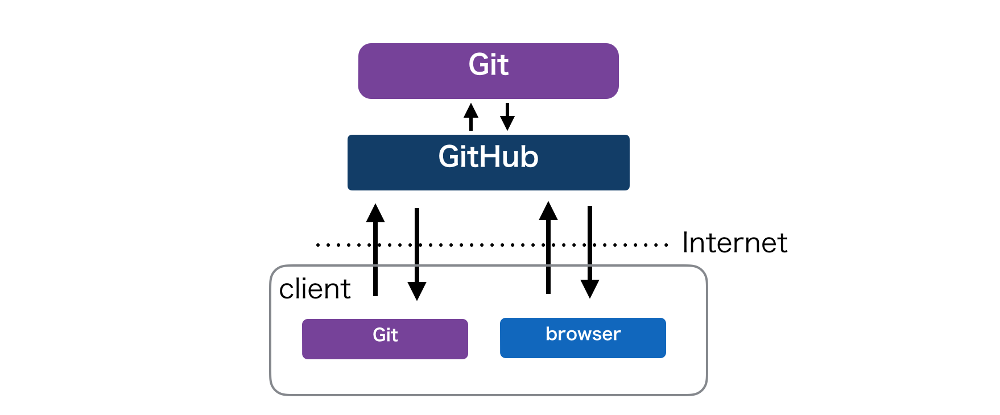

この記事は[Git Advent Calendar 2015](http://qiita.com/advent-calendar/2015/git)の16日目の記事です。

# GitHub おじさん スターターキット

この記事を読むと、**GitHub と Git を人に紹介する時**や、**GitHub 導入後**に注意すること、**GitHub 普及の際のメンタル**ついて知識が得られます。
ある程度、Git, GitHub の知識があり、これから現場に GitHub を普及させたい方に有用な記事かもしれません。
技術的な Tips は少なめです。

### 目次

どうも、[GitHub おじさん](http://www.slideshare.net/yutakakinjyo/github-36864200)、または [一度死んだおじさん](http://www.slideshare.net/yutakakinjyo/hackerscample-lt-49900119) こと沖縄の金城です。GitHubについてと人に説明する機会や導入する機会が多いので、その経験から、どんなことに注意しながら進めていけばいいか書いてみます。

記事は 「紹介編」,「導入後編」,「おじさん編」の３つの編から構成されています。

**紹介編**
- Git はバージョン管理ツール、 GitHub は Git のホスティングサービス
- コミットはセーブ
- ブランチは並行世界
- ブランチは変更のバッファ

**導入後編**
- push -f 禁止
- 分からなくなっても clone し直さない
- ローカルとリモートを意識する
- 変更をコミットしないと、ブランチを移動した時に持ち越す
- コミットは細かく、メッセージには理由を、Pull Request は小さく

**「おじさん」編**
- まずはやってみる
- やり続けるということ
- 自分が一番のファンであること
- 自分が見本になる

## 紹介編

紹介編では、GitHub とは何か、とういことを人に説明するときにおさえておきたい要点を、書き出します。

#### Git はバージョン管理ツール、 GitHub は Git のホスティングサービス

まず、一番初めに説明することはこうです。

「Git はバージョン管理ツールです、 GitHub は Git のホスティングサービスです。」

初めは Git と GitHub について位置づけを説明します。
よく似てる言葉なので、混同されてる方がいます。この区別が付かないまま話を進めてしまうと、明確に理解をしてもらえません。
できれば簡単な図なども利用して、直感的に理解してもらうようにしましょう。

この時、

「Git には、Subversion のようなバージョン管理です。」

という風に相手が既知なバージョン管理の知識と紐付けることをお勧めします。( VSS でも mercurial でもなんでもいいです。)
( いや、でも実際には Subversion とは全然違うし... ) と思っていても大丈夫です。まずは相手の知ってる知識とつなげて、理解してもらい、その後で差分を説明しましょう。

次に「ホスティング」の説明をします。僕はよく

「Git を中心に開発者がコミュニケーションしやすい機能をつけたもの。Web 上から閲覧できる」

という説明をします。これで、最初に発言した

「Git はバージョン管理ツールです、 GitHub は Git のホスティングサービスです。」

という言葉それぞれが、聞いている側の既に知っている知識と紐づくようになります。  
いきなり、Git, GitHub の細かい説明から入ってしまうと、聞き手を置いてけぼりにしてしまう可能性がありますので、初めは必要な情報を外さないように丁寧に行きましょう。

### コミットはセーブ

何かしらのバージョン管理ツールを使ったことがある人であれば、コミットについての説明は簡単です。

「他のバージョン管理と同じです。」

と伝えます。  
バージョン管理がわからない場合には、「コミットはゲームのセーブを分けること」であることを伝えています。

「セーブを分けることで、やり直したい時に戻れるでしょう？それと同じです。」

それがいわゆるバーションであることを伝えます。

### ブランチは平行世界

大事な概念であるブランチについても念入りに説明しておきましょう。
ブランチを説明するときには図が大事だと思っています。コミットグラフを用いて図を書きながら動的に説明するのがいいでしょう。
この時点でコミットグラフが理解できるようしておきましょう。
実際にコマンドを実行して、グラフが変化していく様子をシミュレートできるサイトもあります [Visualizing Git Concepts with D3](http://www.wei-wang.com/ExplainGitWithD3/)

また

「ブランチは平行世界」

だと説明することが多いです。SF の知識がある程度あれば通じますね。

### ブランチは変更のバッファ

ブランチの理解が進むと加えて

「ブランチは変更のバッファです」
「Pull Request は変更の確認です」

と僕はよく説明します。
それを説明するために、比較に他のバージョン管理を上げます。  

- VSS や Suversion 等では変更をコミットをすると一発で中央にあるリポジトリに反映される。
- Branch と Pull Request を利用することで、一旦変更をバッファにとっておくことができる。
- そのバッファは Web 上から確認でき、差分として表示される。差分にはコメントできる。
- レビューが済んだら、ボタンひとつで本体のコードに取り込むことができる。
- そうして、本体のソースコードを守りつつ、バッファに対してレビューができる。
- 要するに、バージョン管理ツールとしてだけではなく、開発のフローをシステムが提供してくれる。

と言った流れです。また

「Pull Request はブランチが他のブランチに合流するときの間に発生するもの」

という説明をします。やはり位置づけを理解することが大事になりますので、どのタイミングで Pull Request が作成されるのか図を書いて説明するといいと思います。

### 紹介編まとめ

と言った風に、とくに GitHub を紹介するにあたっては

- Git と GitHub の位置づけ
- Git と 他のバージョン管理との違い
- ブランチと Pull Request による開発フロー

の３つの特徴があるのではないかと思って、それらを説明しています。
加えて、聞き手の反応がいい場合には、CI 連携ができる。など周辺のエコシステムについて説明などをします。

## 導入後編

GitHub のことを丁寧に説明したら、次はいよいよ導入です。実際に開発で使う段階になると Git の難しさがメンバーに立ちはだかります。  
初めて Git を触る人がいる場合の事故の予防策や、ハマりがちな問題をいくつか書いてみます。

### push -f 禁止

初めは事故りやすいので、その予防をするといいと思います。

**`push -f`  禁止**

これです。歴史さえ書き換えなければ事故が起きても復旧できます。  
最初のうちはこういった歴史書き換え系のコマンドは禁止してもいいと思います。

### 分からなくなってもリポジトリを clone し直さない

**リポジトリの clone は一度だけ**

手っ取り早く Git に慣れるには「ワケが分からなくなってもリポジトリを clone し直さない」ことです。
思考停止せずに、現状を把握して、今の状態からやりたいことをやるにはどうしたらいいか、初めのうちはそこを一生懸命考えて理解する必要があります。
Git を使ってもらう際には、なるべく clone は一度きりで頑張ってもらいましょう。  

そのために、以下のような現状を確認できるコマンドを、念入りに説明しておいた方がいいでしょう。

- git branch
- git status
- git diff
- git log

加えてよりスムーズに Git を理解するには、以下の３つの領域があることを説明するといいと思います。

- working tree
- index( stage )
- repository

それぞれの領域の意味をしっかりと伝えると、次に何のコマンドを打つべきなのか見えてきます。
Git の基本的な操作では、加えた変更が各領域を移動していきますから、そこがイメージできるようにしてあげると、スッキリしてくれると思います。
なぜ、commit の前に add しないといけないのか、そういった疑問を持つ人は多いかなと思いますので、理解を手伝って上げましょう。

### ローカルとリモートを意識する

Git のような分散バージョン管理システムになるとリモートとローカルを意識する必要があります。  
「ローカルリポジトリにコミットしたので、勝手にリモートリポジトリに反映される。」と思う人も多いです。

ローカルリポジトリとリモートのリポジトリの位置関係や、同期の取り方についてもしっかり説明したほうがいいでしょう。

### 変更をコミットしないと、ブランチを移動した時に持ち越す

よく起きがちで、はじめたての人の心を折る現象として、

「別のブランチに移動しようとしても、なんかエラーが出てできない。」

というものがあります。  
これは変更をコミットせずにブランチを移動しようとして、移動先のファイルとコンフリクトしてしまう場合です。
先ほど説明した、３つの領域と合わせて、どの領域にある変更がブランチ越しに持ち歩くのかを説明することで、理解してくれると思います。  

具体的な解決方法として stash を説明するものいいですね。  
僕はいったん現在のブランチにコミットして、ブランチを移動してもらうほうが、事故が少ないと考えています。それなので、ブランチが移動できない場合の方にはコミットを推奨しています。

### コミットは細かく、メッセージには理由を、Pull Request は小さく

最後に Git, GitHub のパワーが効率よく引き出されるコツとして、以下の３つのポイントがあると思います。

- コミットは細かく
- メッセージには理由を
- Pull Request は小さく

丁寧な運用を心がけようと思うと、一度の変更は小さければ小さい方がいいですね。

具体的にどう説明するかというと、以下のような感じでしょうか

 - コミットを細かくするには、ファイル毎に add して commit してもらうのがわかりやすい単位だと思います。
 - メッセージにはやったことではなく、なぜそうしたかを書いてもらうように意識するといいですね。
 - コミットを細かくしていくことが、一度の Pull Request の変更を小さく抑える方法だと思います。

今までにない開発のフローになるので、初めての方にはなかなか難しいようです。  
もし一緒に運用しているなら、あなたがコミットや Pull Request を実際に行って、上のような見本を見せ続けることで、いつしか周りの方も出来るようになってきます。

### 導入編まとめ

以上が僕がよく遭遇してきた導入時のトラブルになります。  
簡単に説明して、ぱっとできる人もいれば、なぜか多くのトラブルにぶつかってしまう人もいます。
導入してみて、一度しっかり説明しておいた方がいいなと感じたら、ハンズオンなどを開いてもいいかもしれませんね。
相手に何かを伝えるときは、これといった決まった方法はないと思います。状況をよく観察して問題となっているところを解決できるように、自分で創意工夫する必要もあると思います。

## おじさん編

今までにない技術を現場に取り入れるには、ときにとても大変な場合があります。
他の会社のエンジニアが、現場に技術を導入している話しを聞いて、

「よし、自分も頑張るぞ！」

と意識が高まることもあると思います。しかしいざ実際にやってみると、案外つまらなかったり、誰も共感してくれなかったり、思った通りにいきません。

>「あれ？おかしいな。やっぱり自分が間違ってるのかな ... 」  
>「あれは別の世界の人の話で、自分がいる所ではやっぱり、無理なのかな ... 」  
>「やっぱり自分の力では無理 ...  

ということで、儚くもやる気はどこかへ行ってしまい、翌日からいつもの日常が戻ってきます。

いったいあのやる気に満ちた気持ちはなぜこうもあっさりと折れてしまうのか。
あの人は続けられたのに自分はうまくいかない。
そのような、悩みを抱えている方が、少なからずいらっしゃるのではないかと思います。

今後、「GtiHubおじさん」になろうと思っている方、または少しでも現状を改善したい方に対して、僕が 「GitHub おじさん」を続けるために、気をつけたことや支えになっている出来事を紹介したいと思います。

### まずはやってみる

もしやるか、やらないかを迷っている場合はやりましょう  
ダメそうならやめましょう  
そして、別の手を考えてまたそれをやりましょう  
思いつく限りを全部やりつくしたら諦めましょう  

**意外と諦める前にどれか一つはうまくいったりします。**  

また順番は意識しない方がいいでしょう。
「まずあれをやって」「次にこれをやって」とういうように、順番を待っていてはなかなか物事は進みません。思いついたことはどんどんやってみるといいですね。
やらない言い訳はいくらでもできます、とにかくやってみることが重要です。

### やり続けるということ

GitHub の導入には時に根気が必要なこともあります。それを継続してくのは、本当に難しいです。
継続していって本当に良くなるかもわかりませんし、成果が出るまでは地味ですし、誰も褒めてはくれませんし、辛いです。
そういった時に、僕自身が心の支えにしてきた言葉がいくつかありますので、紹介します。

> まずは一歩進む。それができたら、また一歩進む。それを繰り返していく内にいつの間にか、遠くへいける。その一歩を踏み出す為に、時には愚かな勇気みたいなものが必要かもしれない  
> &mdash; 会社上司の言葉

--

> あなたは時間を味方につける必要があるということ、そして毎日前へ進む必要があるということだ。遅かれ早かれあなたは勝つだろう。  
> &mdash; [射撃しつつ前進 - Joel Spolsky](http://japanese.joelonsoftware.com/Articles/FireAndMotion.html)

--

> Life must improve as it takes its course.  
> Your youth you spend in preparation  
> because the best things are never in the past, but in the future.  
> 人生は進歩です  
> 若い時代は準備のときであり、  
> 最上のものは過去にあるのではなく将来にあります  
> &mdash; NHK連続テレビ小説「花子とアン」 卒業式でのブラックバーン校長のスピーチ

なにかを達成するには、とても単純な仕組みがあって、出来るまでやり続けるだけなんですよね。ただそれだけなんですよね。

### 自分が一番のファンであること

周りで自分自信が一番、GitHub を好きであることは重要です。
GitHub を勧める人から、あまり好きでない様子が伺えたら、勧められてる方は乗り気になれないですね。
人間は感情の生きものです。ロジカルに説明することも大切ですが、それと同じぐらい心に訴えかけることも大事だと思っています。
常に自分が一番のファンであること、その好きという気持ちは、周りに伝わっていきますよ。

### 自分が見本になる

自らが見本になることが大事です。
人に口ばっかり出していて、自分自身はそれを行わないのであれば、誰もついては来てくれません。
あたな自身が先陣を切って、GitHub を使いこなしていく必要があり、その様子をみてもらう必要があります。
なるべく多くの機会で GitHub を使ってその有用性をアピールしましょう。

### おじさん編まとめ

<blockquote class="twitter-tweet" lang="en">
もしかすると、「おじさん」とは、今進んでいる道で本当にあっているか不安なとき、先が見えずに進んでいるのか後退してるのか不安なときに「大丈夫だ、問題ない」と背中を押す人たちの称号なのかもしれない。
&mdash; YutakaKINJO (@Yutaka_Kinjyo) <a href="https://twitter.com/Yutaka_Kinjyo/status/637502493337915392">August 29, 2015</a></blockquote>

新しい技術や方法にチャレンジする人が、迷ったり、不安になっても、「あの人に聞けば大丈夫」とか「あの人が言っていたから大丈夫」と、めげそうになっても「おじさん」というその存在が支えなってくれるのはないですかね。

そういう、いつでも人の背中を押す存在が、「おじさん」という称号なんじゃないですかね。
