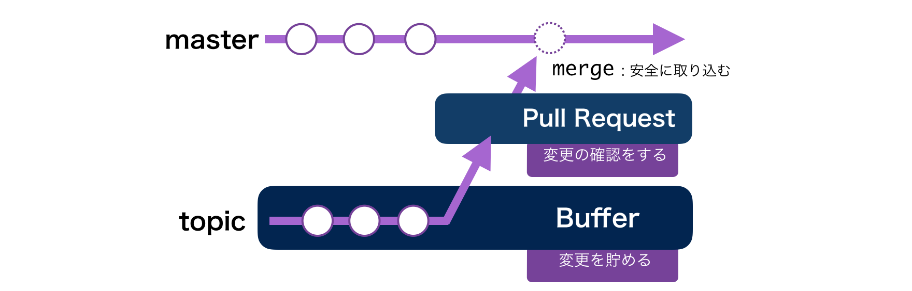

この記事は[Git Advent Calendar 2015](http://qiita.com/advent-calendar/2015/git)の16日目の記事です。

# GitHub おじさん スターターキット

この記事を読むと、**GitHub と Git を人に紹介する時**や、**GitHub 導入後**に注意すること、**GitHub 普及の際のメンタル**ついて知識が得られます。
ある程度、Git, GitHub の知識があり、これから現場に GitHub を普及させたい方に有用な記事かもしれません。
技術的な Tips は少なめです。

### 目次

どうも、[GitHub おじさん](http://www.slideshare.net/yutakakinjyo/github-36864200)、または [一度死んだおじさん](http://www.slideshare.net/yutakakinjyo/hackerscample-lt-49900119) こと沖縄の金城です。GitHubについてと人に説明する機会や導入する機会が多いので、その経験から、どんなことに注意しながら進めていけばいいか書いてみます。

記事は 「紹介編」,「導入後編」,「おじさん編」の３つの編から構成されています。

**紹介編**
- Git はバージョン管理ツール、 GitHub は Git のホスティングサービス
- コミットはセーブ
- ブランチは並行世界(世界線)
- ブランチは変更のバッファ

**導入後編**
- Git には worktree, index, repository の３つの領域がある
- push -f 禁止、分からなくなっても clone し直さない
- 変更をコミットしないとブランチを移動した時持ち越す
- コミットは細かく、メッセージは詳しく、Pull Request は短く

**「おじさん」編**
- 「おじさん」になるには名乗るだけ。中身は後からついてくる
- 「これが出来てから」ではなくてさっさと全部やる

## 紹介編

紹介編では、GitHub とは何か、とういことを人に説明するときの要点を書き出します。

#### Git はバージョン管理ツール、 GitHub は Git のホスティングサービス

まず、一番初めに説明することはこうです。

**「Git はバージョン管理ツールです、 GitHub は Git のホスティングサービスです。」**

初めは Git と GitHub について位置づけを説明します。
よく似てる言葉なので、混同されてる方がいます。この区別が付かないまま話を進めてしまうと、明確に理解をしてもらえません。

この時、

「Git には、Subversion のようなバージョン管理です。」

という風に相手が既知なバージョン管理の知識と紐付けることをお勧めします。( VSS でも mercurial でもなんでもいいです。)
( いや、でも実際には Subversion とは全然違うし... ) と思っていても大丈夫です。まずは相手の知ってる知識とつなげて、理解してもらい、その後で差分を説明しましょう。

次に「ホスティング」の説明をします。僕はよく

「Git を中心に開発者がコミュニケーションしやすい機能をつけたもの。Web 上から閲覧できる」

という説明をします。これで、最初に発言した

「Git はバージョン管理ツールです、 GitHub は Git のホスティングサービスです。」

という言葉それぞれが、聞いている側の既に知っている知識と紐づくようになります。  
いきなり、Git, GitHub の細かい説明から入ってしまうと、聞き手を置いてけぼりにしてしまう可能性がありますので、初めは必要な情報を外さないように丁寧に行きましょう。

### コミットはセーブ

何かしらのバージョン管理ツールを使ったことがある人であれば、コミットについての説明は簡単です。

「他のバージョン管理と同じです。」

と伝えます。  
バージョン管理がわからない場合には、コミットはゲームのセーブであることを伝えています。

「セーブを分けることで、やり直したい時に戻れるでしょう？」

それと同じです。
それがいわゆるバーションであることを伝えます。

### ブランチは平行世界

大事な概念であるブランチについても念入りに説明しておきましょう。
ブランチを説明するときには図が大事だと思っています。コミットグラフを用いて図を書きながら動的に説明するのがいいでしょう。
この時点でコミットグラフが理解できるようしておきましょう。
実際にコマンドを実行して、グラフが変化していく様子をシミュレートできるサイトもあります [Visualizing Git Concepts with D3](http://www.wei-wang.com/ExplainGitWithD3/)

また

「ブランチは平行世界」

だと説明することが多いです。SF の知識がある程度あれば通じますね。

### ブランチは変更のバッファ

加えて

「ブランチは変更のバッファです」
「Pull Request は変更の確認」 

と僕はよく説明します。
それを説明するために、比較に他のバージョン管理を上げます。  

- VSS や Suversion 等では変更をコミットをすると一発で中央になるリポジトリに反映される。
- Branch と Pull Request を利用することで、一旦変更をバッファにとっておくことができる。
- そのバッファは Web 上から確認でき、差分として表示される。差分にはコメントできる。
- レビューが済んだら、ボタンひとつで本体のコードに取り込むことができる。
- そうして、本体のソースコードを守りつつ、安全にレビューができる。
- 要するに、バージョン管理ツールとしてだけではなく、開発のフローをシステムが提供してくれる。

と言った流れです。また

「Pull Request はブランチが他のブランチに合流するときの間に発生するもの」

という説明をします。やはり位置づけを理解することが大事になりますので、どのタイミングで Pull Request が作成されるのか図を書いて説明するといいと思います。

### 3つの特徴

と言った風に、とくに GitHub を紹介するにあたっては

- Git と GitHub の位置づけ
- Git と 他のバージョン管理との違い
- ブランチと Pull Request による開発フロー

の３つの特徴があるのではないかと思って、それらを説明しています。
加えて、聞き手の反応がいい場合には、CI 連携ができる。など周辺のエコシステムについて説明などをします。

## 導入後編

GitHub のことを丁寧に説明したら、次はいよいよ導入です。実際に開発で使う段階になると Git の難しさがメンバーに立ちはだかります。  
初めて Git を触る人がいる場合の事故の予防策や、ハマりがちな問題をいくつか書いてみます。

### push -f 禁止

初めは事故りやすいので、その予防をするといいと思います。

**`push -f`  禁止**

これです。歴史さえ書き換えなければ事故が起きても復旧できます。  
最初のうちはこういった歴史書き換え系のコマンドは禁止してもいいと思います。

### 分からなくなってもリポジトリを clone し直さない

**リポジトリの clone は一度だけ**

手っ取り早く Git に慣れるには「ワケが分からなくなってもリポジトリを clone し直さない」ことです。
思考停止せずに、現状を把握して、今の状態からやりたいことをやるにはどうしたらいいか、初めのうちはそこを一生懸命考える必要があります。

以下のような現状を確認できるコマンドを、念入りに説明しておいた方がいいでしょう。

- git branch
- git status
- git diff
- git log

加えてよりスムーズに Git を理解するには、以下の３つの領域があることを説明するといいと思います。

- working tree
- index( stage )
- repository

それぞれの領域の意味をしっかりと伝えると、次に何のコマンドを打つべきなのか見えてきます。
Git の基本的な操作では、加えた変更が各領域を移動していきますから、そこがイメージできるようにしてあげると、スッキリしてくれると思います。
なぜ、commit の前に add しないといけないのか、そういった疑問を持つ人は多いかなと思います。

### ブランチがどこから生えるてるのかわからなくなる

分散リポジトリ管理になるとリモートとローカルを意識する必要があります。

初めはブランチを
現在のブランチに注意しながら
リカバリの方法を根気良く伝えていきましょう。
現在どのブランチにいるかわからずに新たにブランチを
本来は master から生やしたいのに。というものがありますので、

リモートなのかローカルなのか。その差分が重要です。

### 変更をコミットしないとブランチを移動した時持ち越す

よく起きがちで、始めたての人の心を折る現象として、

「別のブランチに移動しようとしても、なんかエラー出てできない。」

というものがあります。  
これは変更をコミットせずにブランチを移動しようとして、移動先のファイルとコンフリクトしてしまう場合です。
先ほど説明した、３つの領域と合わせて、どの領域にある変更がブランチ越しに持ち歩くのかを説明することで、理解してくれると思います。

### コミットは細かく、メッセージは詳しく理由を、Pull Request は短く

すこし番外編
運用がぐんと楽になる、GitHub のパワーが効率よく引き出されることとして、以下の３つのポイントがあります。

- コミットは細かく
- メッセージは詳しく理由を
- Pull Request は短く

## おじさん編

Git や GitHub があまり普及していない現場で

「おじさん」になるには名乗るだけ。中身は後からついてくる

「おじさん」駆動でその分野に詳しくなるというのがある。名乗ると自然と質問とかが集まってきて、
それに答えることがモチベーションになって
だから、勉強したい分野とかがあったりすると、先にそのことについて詳しいみたいな感じにするといい。

